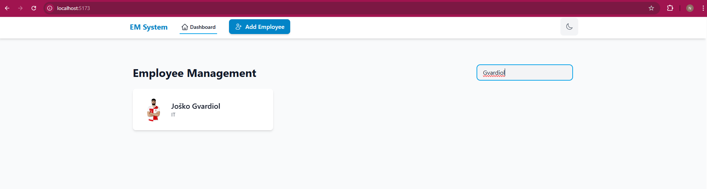

# Employee Management System

A full-stack web application for managing employee information, built with React (TypeScript) for the frontend and Node.js (Express + TypeScript) for the backend.

## Features

- Employee CRUD Operations
- Employee Profile Management
- File Upload System
- Modern and Responsive UI
- Secure Authentication
- Role-based Access Control

## Tech Stack

### Frontend
- React with TypeScript
- Tailwind CSS for styling
- Vite as build tool
- React Router for navigation
- React Query for state management

### Backend
- Node.js with TypeScript
- Express.js framework
- SQL Server for database
- JWT for authentication
- Multer for file uploads

## Screenshots

### Employee Dashboard


### Employee List


### Employee Profile


### Add Employee Form


### Edit Employee


### File Upload System


### Role Management


### User Authentication


### System Overview


## Installation

### Prerequisites
- Node.js (v14 or higher)
- SQL Server
- Git

### Backend Setup
1. Navigate to the backend directory:
```bash
cd backend
```

2. Install dependencies:
```bash
npm install
```

3. Create a .env file with the following variables:
```env
PORT=5000
DB_HOST=your_db_host
DB_USER=your_db_user
DB_PASSWORD=your_db_password
DB_NAME=your_db_name
JWT_SECRET=your_jwt_secret
```

4. Start the backend server:
```bash
npm run dev
```

### Frontend Setup
1. Navigate to the frontend directory:
```bash
cd frontend
```

2. Install dependencies:
```bash
npm install
```

3. Create a .env file with:
```env
VITE_API_URL=http://localhost:5000
```

4. Start the frontend development server:
```bash
npm run dev
```

## Project Structure

```
employee-management/
├── backend/
│   ├── src/
│   │   ├── controllers/
│   │   ├── models/
│   │   ├── routes/
│   │   ├── middleware/
│   │   └── server.ts
│   ├── uploads/
│   └── package.json
├── frontend/
│   ├── src/
│   │   ├── components/
│   │   ├── pages/
│   │   ├── services/
│   │   └── App.tsx
│   └── package.json
└── screenshots/
```

## Contributing

1. Fork the repository
2. Create your feature branch (`git checkout -b feature/AmazingFeature`)
3. Commit your changes (`git commit -m 'Add some AmazingFeature'`)
4. Push to the branch (`git push origin feature/AmazingFeature`)
5. Open a Pull Request

## License

This project is licensed under the MIT License - see the LICENSE file for details. 